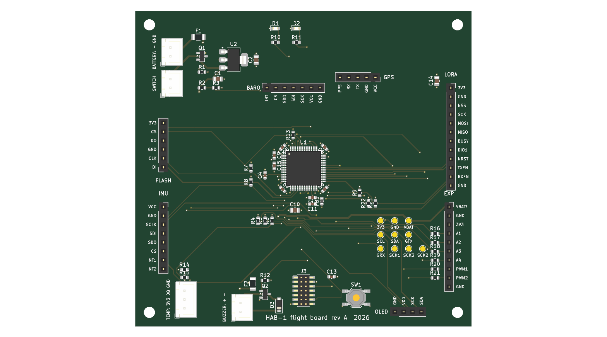

# HAB-1 — a homemade flight computer for a stratospheric balloon

HAB-1 is an experimental payload for a high-altitude weather balloon. It will climb to
about **30 km**, record what happens on the way up, fall back under a parachute, and then
has to be found on the ground. First flight planned in **Thailand, February–March 2027**.

**Interactive 3D model:** https://claude.ai/artifact/VP8YPhxGNXckYP5Keu93rK
— scrub through the flight, open the box and look at the board inside.
**Code and design files:** https://github.com/barcklay/Cube_SAT (this repository)

<!-- PHOTOS: add docs/photos/bench_top.jpg, docs/photos/modules.jpg, docs/photos/telemetry.jpg
     and a short video link here (Linear HW-157). -->



## About me

I'm Ilzira Badretdinova. I have lived in Bangkok for four years. I design HAB-1 on my own —
the electronics, the firmware, the circuit board and the enclosure — and I would like to
fly it for the first time **together with an experienced team**.

## What already works

Everything below runs today on the bench (NUCLEO-G474RE development board + breadboard
with the real sensor modules) and has been tested:

| Part | What it does | Status |
|---|---|---|
| **STM32G474** firmware | reads all sensors 5 times a second, one telemetry frame every 200 ms | ✅ tested |
| **Barometer** BMP390 | pressure, temperature, altitude (layered standard atmosphere, 0–47 km) | ✅ tested |
| **IMU** ICM-42688 | acceleration and rotation: swing, burst, parachute opening | ✅ tested |
| **GPS** u-blox MAX-M10S | position and altitude; set to *Airborne <4g* so it keeps working above 12 km | ✅ tested on the ground |
| **Outside temperature** DS18B20 | air temperature through the box wall | ✅ tested |
| **Black box** 16 MB SPI flash | every frame logged with a CRC; survives power cuts and resets | ✅ tested |
| **Watchdog + sensor recovery** | a hung program restarts in 2 s; a lost sensor is marked and retried every 5 s | ✅ tested by pulling wires live |
| **Flight state machine** | PRELAUNCH → ASCENT → FLOAT → BURST → DESCENT → LANDED; continues after a reset in flight | ✅ tested in simulation, on the laptop and in a lift |

## Still in development / not tested yet

| Part | Status |
|---|---|
| **LoRa radio** E22-400M22S (433 MHz) and the ground station | ⏳ parts on the way, not brought up yet |
| **Flight PCB** — 4-layer CubeSat 1U board, modules on sockets | designed and routed (ERC/DRC clean), ⏳ independent review, then manufacture |
| **Enclosure** — foam box with a 3D-printed sled | concept ready, not built |
| **Cold test** (dry ice, −60 °C), drop test, tethered flight | ⏳ planned |
| **Backup tracker, recovery buzzer, parachute** | ⏳ to buy / to build |

## Main parameters (preliminary)

| | |
|---|---|
| Payload mass | **≈ 400–600 g** (estimate: ~400 g without a camera, ~600 g with one); weighed after assembly |
| Payload size | **≈ 250 × 175 × 140 mm**, orange foam box (XPS, 30 mm walls) |
| Flight board | 95.9 × 90.2 mm (CubeSat 1U), STM32G474RET6 |
| Power | 4 × Energizer L91 lithium AA (work down to −40 °C), 3.3 V regulator |
| Radio | LoRa 433 MHz (E22-400M22S); output power to be set within Thai (NBTC) limits |
| Tracking and recovery | GPS position over LoRa during the flight; separate backup GPS/SIM tracker with its own battery; buzzer after landing; contact label on the box |
| Balloon / parachute | latex balloon, burst at ~30 km expected; parachute for ~5 m/s at the ground (not chosen yet) |
| Expected flight | ~1 h 40 min up, ~45 min down, landing 30–80 km from the launch point (depends on winds) |

## What the flight should prove

1. The flight computer works end to end in real conditions: cold, low pressure,
   vibration at burst — and recognises every phase of the flight on its own.
2. The black box records the whole flight without gaps.
3. Radio telemetry reaches the ground station, and the payload can be tracked and found.
4. A measured temperature and pressure profile of the tropical atmosphere up to ~30 km
   (the tropopause over Thailand is colder than −75 °C).
5. Photos of the horizon from the stratosphere (if a camera flies).

## What I'm looking for

- **A joint launch**, or a place for HAB-1 in an existing balloon mission.
- **A technical review** of the payload by people who have flown before.
- **Help with permissions**: CAAT (unmanned free balloon), NOTAM, and the radio.
  **I do not have a flight permission yet.**

## Things I found and fixed along the way

- The usual barometric formula is only valid below 11 km: at 30 km it reads **~4.7 km too
  low**. The firmware now uses the layered standard atmosphere.
- A pulled DS18B20 wire read as a perfectly valid **0.0 °C** (all-zero data passes the CRC).
  The firmware now checks bits the sensor always sets.
- The IMU breakout corrupted the flash on a shared SPI bus, so each has its own bus.
- Two of five sensor modules had a different pin order than expected; every socket on the
  PCB was checked against the real module before routing.

## Repository

| Folder | What is inside |
|---|---|
| `hab_bringup/` | STM32 firmware (STM32CubeMX + CMake). Flight logic in `Core/Inc/flight_sm.h` |
| `tools/` | live telemetry viewer, log download, flashing, the lift test, the state machine test |
| `hardware/flight_pcb/` | flight board: spec, schematic and PCB **generated by Python scripts**, auto-routing with Freerouting, checks |
| `mission/launch_site/` | how the launch site was chosen: airports, military areas, borders, terrain, predicted landing points |
| `portfolio/lab/` | the interactive 3D page |
| `bmp390_altitude/`, `flash_boot_counter/`, `FlashCard/` | first bring-up experiments |

## How it is checked

- **Firmware:** `tools/test_flight_sm.c` flies 10 synthetic balloons through the state
  machine (normal flight, noisy sensor, slow leak, 3 h float, reset in flight,
  stop-and-go ascent…); an accelerated fake flight runs on the real board (`S` command).
- **Board:** KiCad ERC and DRC, a netlist check against the generator's tables, and
  schematic-to-PCB parity — all clean before a change is committed.

```sh
python3 tools/telemetry.py          # live view of the board over USB
python3 tools/logdump.py            # download the black box as CSV
cc -O2 -o /tmp/t tools/test_flight_sm.c -lm && /tmp/t   # state machine tests
```

## Contact

Ilzira Badretdinova, Bangkok · **ilzira.reads@gmail.com** · or open an issue in this repository.
