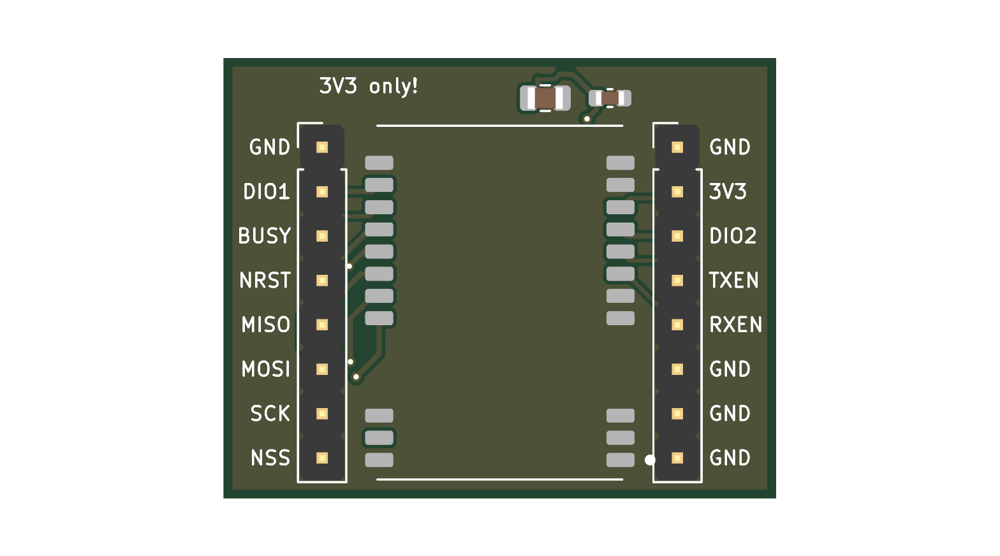

# E22-400M22S breakout board

The Ebyte E22-400M22S LoRa module has castellated pads at 1.27 mm pitch: it fits neither a
breadboard nor jumper wires, and no ready adapter with 2.54 mm pins is sold for it. This small
board (31.6 x 25.2 mm, 2 layers) brings every pin out to two rows of ordinary pins 0.8 inch
(20.32 mm) apart, so it plugs into a breadboard. It is for the bench and the ground station;
the flight board carries the module itself.

| Left row, top to bottom | Right row, top to bottom |
|---|---|
| GND | GND |
| DIO1 | 3V3 (the module allows 3.7 V at most) |
| BUSY | DIO2 |
| NRST | TXEN |
| MISO | RXEN |
| MOSI | GND |
| SCK | GND |
| NSS | GND |

On the board: the module, 4.7 uF + 100 nF at its supply pin, ground pours on both sides, no
tracks under the module on the top side. The antenna goes on the module's own IPX connector.

## Files

`python3 gen_adapter.py` (KiCad's Python) builds everything: `e22_adapter.kicad_pcb` and, in
`fab/`, the gerber zip, BOM and CPL for JLCPCB. JLCPCB solders the module (LCSC C411291) and the
two capacitors; the two 1x8 pin rows are soldered by hand, pins pointing down.

Checked: DRC without errors (one cosmetic silkscreen note), 0 unconnected. Not checked: a real
order; the rotation of the module in the CPL (look at the placement picture in the order form:
the pin-1 dot is at the bottom right, the antenna connector at the bottom left).
